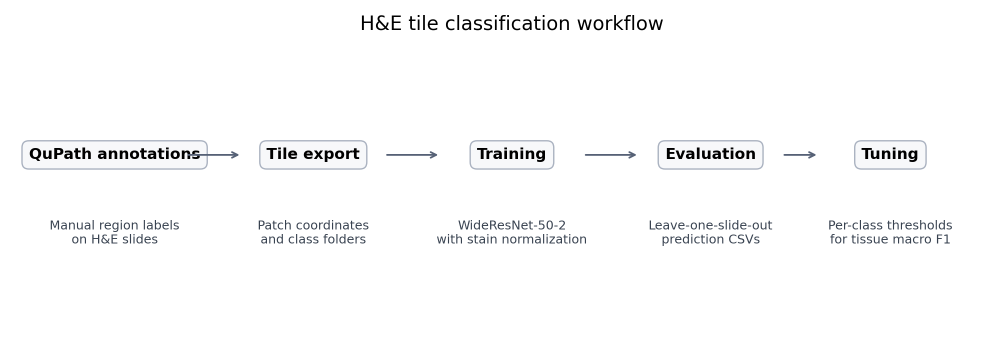
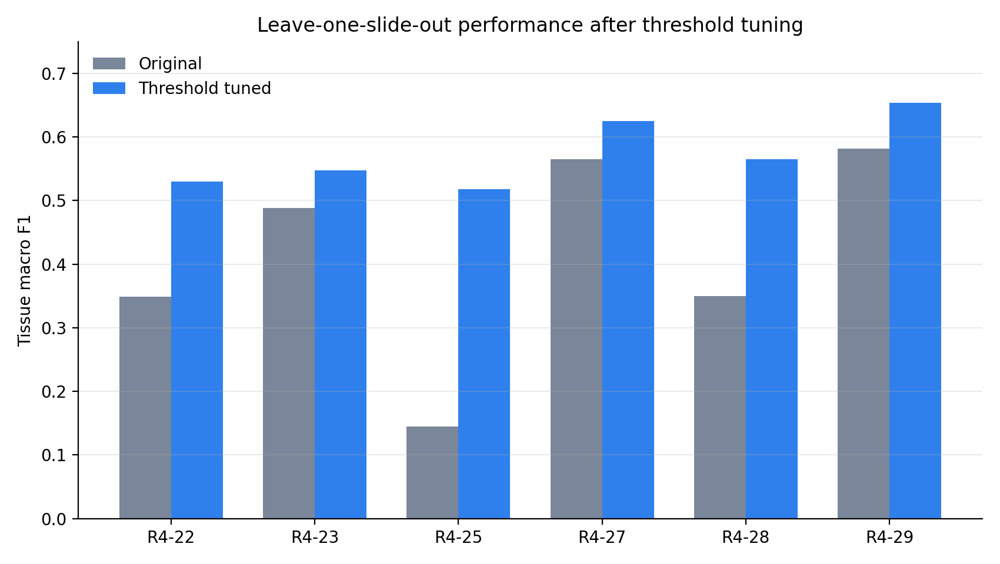
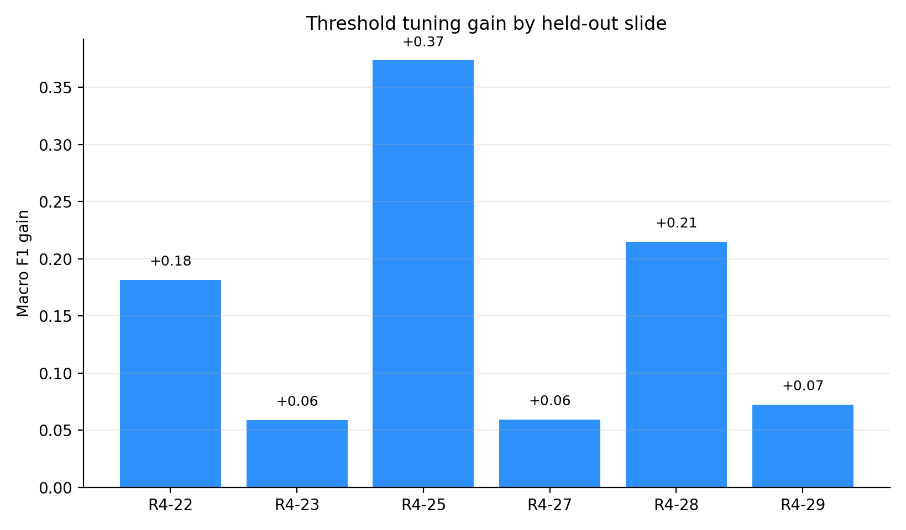
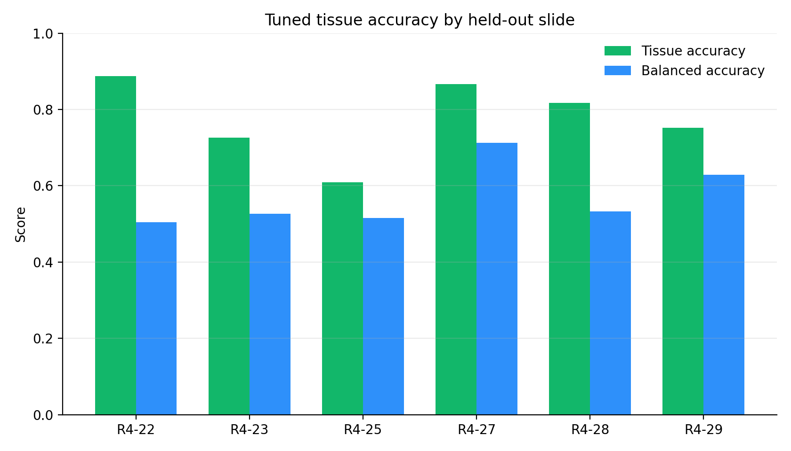
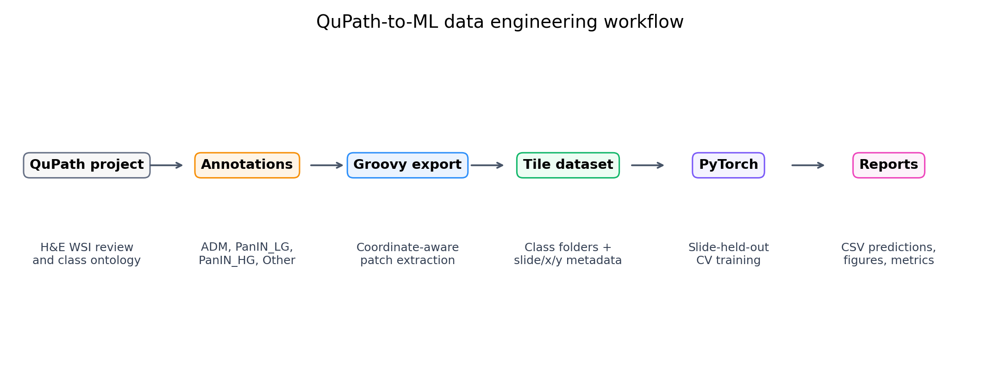
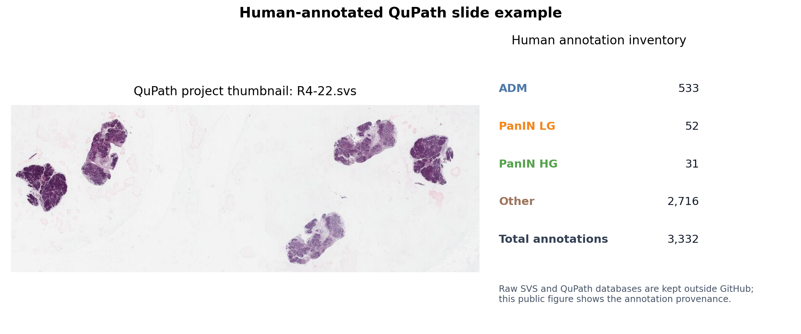
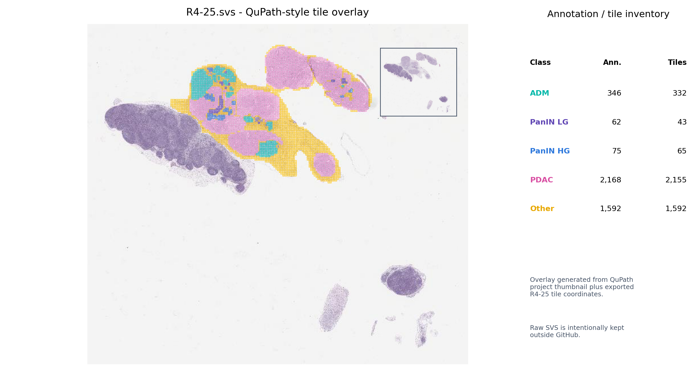
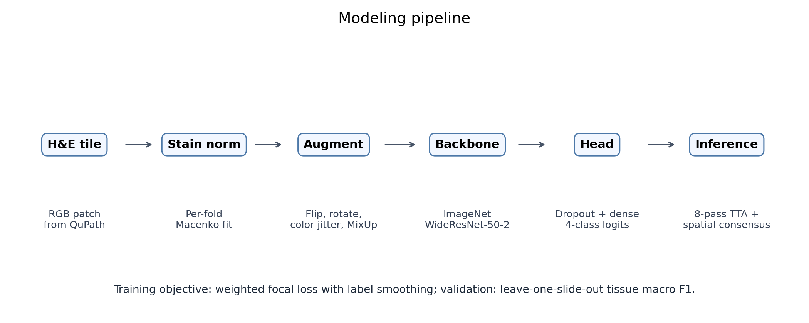
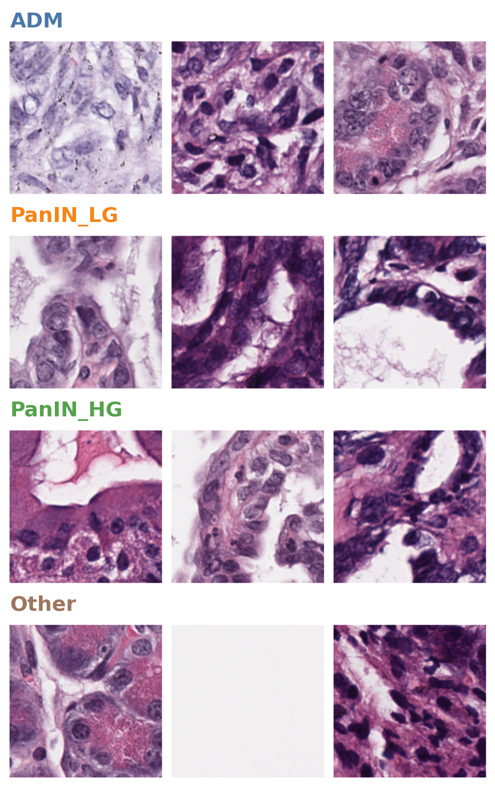

# Pancreas H&E Pathology AI

[](https://github.com/rf2960/pancreas-he-pathology/actions/workflows/validate.yml)

Computer vision pipeline for classifying pancreatic H&E histology tiles from Reya Lab whole-slide images. This repository presents the full public research workflow: QuPath annotation export, tile-level data engineering, PyTorch modeling, leave-one-slide-out validation, post-hoc threshold tuning, reproducibility docs, and publication-style figures.



## Why This Project Matters

Pathology ML projects are difficult because the data are large, class-imbalanced, slide-correlated, and sensitive. This repo demonstrates an end-to-end DS/ML workflow that handles those realities instead of only showing a notebook:

- **Computer vision:** H&E tile classification with an ImageNet-pretrained WideResNet-50-2 backbone.
- **Medical image preprocessing:** QuPath annotation export, coordinate-aware tile parsing, and per-fold Macenko stain normalization.
- **Imbalanced learning:** focal loss, class weighting, balanced slide-stratified sampling, and controlled `Other` downsampling.
- **Robust validation:** leave-one-slide-out evaluation to reduce slide leakage.
- **Inference engineering:** 8-pass test-time augmentation, confidence-aware spatial consensus, and per-class threshold tuning.
- **ML reporting:** model card, reproducibility notes, result CSVs, metric summaries, and artifact/data governance.

## Results At A Glance

The saved evaluation outputs cover **39,944 tile predictions** across **6 held-out slides**, including **4,210 tissue lesion tiles**.

| Metric | Value |
|---|---:|
| Mean original tissue macro F1 | 0.413 |
| Mean tuned tissue macro F1 | 0.573 |
| Mean threshold-tuning gain | +0.160 |
| Mean tuned tissue accuracy | 77.6% |
| Mean tuned tissue balanced accuracy | 57.0% |
| Held-out slides | 6 |

Threshold tuning improved tissue-class macro F1 on every held-out slide in the saved outputs.







## QuPath Annotation Engineering

This project includes the upstream pathology data-engineering work, not only the PyTorch model. QuPath was used to review H&E whole-slide images, define lesion classes, export region-level annotations, and run Groovy scripts that convert annotated regions into coordinate-aware tile datasets.







The repository includes the QuPath scripts in [qupath_scripts/](qupath_scripts/) and documents the workflow in [docs/qupath_workflow.md](docs/qupath_workflow.md).

## Model Architecture



## Example Tiles

Representative public examples are selected with a content-aware sampler so README examples avoid blank background tiles.



## Additional Figures

- [Learned threshold heatmap](figures/threshold_heatmap.png)
- [All-class confusion matrix](figures/confusion_matrix_all.png)
- [Tissue-only confusion matrix](figures/confusion_matrix_tissue.png)
- [Original vs tuned confusion matrices](figures/confusion_matrix_tuned_vs_original.png)
- [Tile class distribution](figures/tile_class_distribution.png)

## Repository Layout

```text
.
|-- src/                  # Training and threshold tuning pipelines
|-- scripts/              # Figure generation, metrics, and maintenance utilities
|-- qupath_scripts/       # QuPath scripts used to export annotated tiles
|-- figures/              # README and process figures
|-- results/              # Lightweight evaluation CSVs and metric summaries
|-- examples/tiles/       # Small representative tile samples
|-- data/                 # Data access notes only; raw data is excluded
|-- models/               # Model checkpoint notes only; checkpoints are excluded
|-- docs/                 # Methods, model card, experiment report, reproducibility
`-- tests/                # Repository integrity tests for CI
```

## Quick Start

Create an environment:

```bash
conda env create -f environment.yml
conda activate he-pathology
```

Run leave-one-slide-out training and evaluation:

```bash
python src/he_ml_pipeline.py \
  --data_dir /path/to/spatial_tiles_dataset \
  --output_dir pipeline_outputs
```

Run threshold tuning after prediction CSVs are generated:

```bash
python src/threshold_tune.py --output_dir pipeline_outputs
```

Regenerate public figures and metric summaries:

```bash
python scripts/make_public_figures.py
python scripts/summarize_results.py
```

Run repository checks:

```bash
python -m pytest
```

## Data And Model Access

This repository intentionally does not include raw whole-slide images, full tile datasets, private credentials, or `.pth` checkpoint files. The detailed project folder is maintained on Google Drive:

<https://drive.google.com/drive/folders/1bzPsdvUn9KUEjALNeJGkmOVVipVVXvzz>

See [docs/data.md](docs/data.md), [models/README.md](models/README.md), and [docs/model_card.md](docs/model_card.md) for expected local paths, artifact handling, and model limitations.

## Documentation

- [Methods](docs/methods.md)
- [Experiment report](docs/experiment_report.md)
- [Model card](docs/model_card.md)
- [Reproducibility](docs/reproducibility.md)
- [Resume positioning](docs/resume_positioning.md)
- [Project inventory](docs/project_inventory.md)
- [QuPath workflow](docs/qupath_workflow.md)
- [Storage cleanup plan](docs/storage_cleanup_plan.md)

## Novelty

- Integrates QuPath annotation scripting with a reproducible PyTorch histopathology pipeline.
- Uses slide-held-out validation rather than random tile splitting to reduce leakage.
- Combines stain normalization, focal loss, balanced sampling, MixUp, test-time augmentation, spatial consensus, and post-hoc threshold tuning in one coherent workflow.
- Packages sensitive biomedical research work as a public, resume-ready repository without exposing raw scans, credentials, or large checkpoints.

## Limitations

- The current model is research-grade and not clinically deployable.
- Class imbalance remains substantial, especially for `PanIN_LG`.
- PDAC is excluded from the final public classifier because available PDAC tiles are not well distributed across slides.
- Threshold tuning should be nested or validated on independent slides before publication-level claims.
- External validation on another cohort or staining protocol has not yet been performed.

## Future Work

- Add more annotated slides, especially for rare lesion classes.
- Evaluate modern histopathology foundation models or self-supervised encoders against the current WideResNet baseline.
- Add nested validation for threshold selection and calibration curves.
- Build slide-level aggregation from tile predictions for specimen-level summaries.
- Add experiment tracking with MLflow or Weights & Biases.
- Package a small inference demo using approved sample tiles.

## Citation

If this repository is useful, cite it using the metadata in [CITATION.cff](CITATION.cff).

## License

Code is released under the MIT License. Data and images remain subject to the Reya Lab/project data-use terms and are not automatically covered by the code license.
